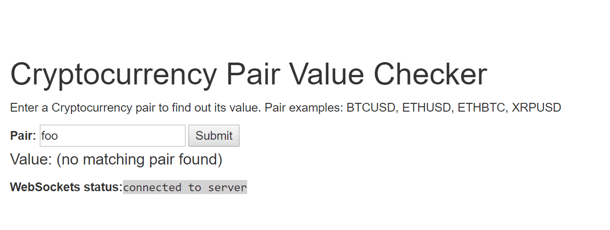

# shift_challenge_currency_pairs
ASP.NET Exchange Rate Checker Web App

Wyatt Fry's submission for the coding challenge to build a simple web app for looking up exchange rates that uses WebSockets to communicate between client and server.

A lot of boilerplate is used for the basic setup, my work is mostly in the following files
- Front end: shift_challenge_currency_pairs\shift_challenge_currency_pairs\Pages\Index.cshtml
- Back end: shift_challenge_currency_pairs\shift_challenge_currency_pairs\Startup.cs

